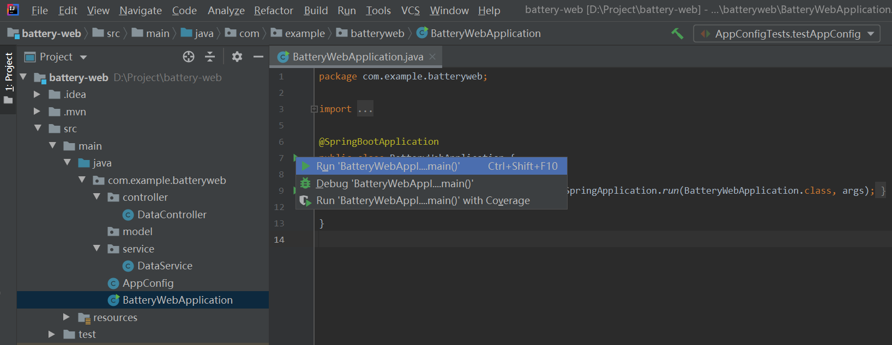

# Lab 3. Invoke EnOS APIs

In this lab, we will invoke EnOS APIs for the following purposes:

- Get the battery asset list
- Get battery asset information
- Get the battery status (health level and remaining power)
- Get the asset alert records
- Set battery data uploading frequency
- Get the dynamic data of batteries: real-time voltage, current, and temperature

## Step 1: Get the Battery Asset List

Invoke the **Search Related Asset Node** API, create `DataService` and `DataController` to get the asset list of smart battery devices by the following steps:

> The request format of **Search Related Asset Node** is `https://{apigw-address}/asset-tree-service/v2.1/asset-nodes?action=searchRelatedAsset`.

1. From the left navigation bar of the project space, open the `src/main/java/com.example.batteryweb` directory and click **File > New > Package** from the menu to create 3 packages separately named `service`, `controller`, and `model` for storing functional classes.

   

2. Open the `service` package, create a class named `DataService` and enter the following codes to get the list of battery assets in the specified asset tree node:

   ```java
   package com.example.batteryweb.service;
   
   import com.envision.apim.poseidon.config.PConfig;
   import com.envision.apim.poseidon.core.Poseidon;
   import com.envision.apim.poseidon.exception.PoseidonException;
   import com.envision.apim.poseidon.request.IPoseidonRequest;
   import com.envisioniot.enos.asset_tree_service.v2_1.SearchRelatedAssetNodeRequest;
   import com.envisioniot.enos.asset_tree_service.v2_1.SearchRelatedAssetNodeResponse;
   import com.envisioniot.enos.asset_tree_service.vo.RelatedAssetSearchVo;
   import com.example.batteryweb.AppConfig;
   import lombok.extern.slf4j.Slf4j;
   import org.springframework.beans.factory.annotation.Autowired;
   import org.springframework.stereotype.Component;
   
   import java.util.ArrayList;
   import java.util.List;
   
   @Component
   @Slf4j
   public class DataService {
       @Autowired
       AppConfig config;
   
       public <T> T getResponse(IPoseidonRequest request, Class<T> cls) throws PoseidonException {
           return Poseidon.config(PConfig.init().appKey(config.accessKey).appSecret(config.accessSecret)).url(config.addr).getResponse(request, cls);
       }
   
       /**
        * Getting the list of assets of specified models and asset tree.
        * @return SearchRelatedAssetNodeResponse
        */
       public SearchRelatedAssetNodeResponse getAssetList() {
           SearchRelatedAssetNodeRequest request= new SearchRelatedAssetNodeRequest();
           request.setOrgId(config.orgId);
           request.setTreeId(config.assetTreeId);
   
           RelatedAssetSearchVo filter = new RelatedAssetSearchVo();
           filter.setIsChildOfAssetId(config.parentAssetId);
           request.setFilter(filter);
   
           return getResponse(request, SearchRelatedAssetNodeResponse.class);
       }
   }
   ```
   
3. Open the `controller` package, create a class named `DataController` and enter the following codes for displaying the queried list of assets as JSON data in browsers:

   ```java
   package com.example.batteryweb.controller;
   
   import com.envisioniot.enos.asset_tree_service.v2_1.SearchRelatedAssetNodeResponse;
   import com.envisioniot.enos.asset_tree_service.vo.AssetVo;
   import com.example.batteryweb.service.DataService;
   import lombok.extern.slf4j.Slf4j;
   import org.springframework.beans.factory.annotation.Autowired;
   import org.springframework.web.bind.annotation.*;
   
   import java.util.*;
   
   @RestController
   @Slf4j
   public class DataController {
       @Autowired
       private DataService dataService;
   
       /**
        * Returning all the battery assets under the "Envision Smart Car Factory" asset tree.
        * @return
        */
       @RequestMapping("/battery/list")
       public Map<String, Object> list() {
   
           SearchRelatedAssetNodeResponse resp = dataService.getAssetList();
   
           List<Map<String, String>> batteries=new ArrayList();
           for (AssetVo asert: resp.getData()) {
               Map<String, String> item = new HashMap<>();
               item.put("assetId", asert.getAssetId());
               item.put("name", asert.getName().getDefaultValue());
               batteries.add(item);
           }
   
           // Ordering the display of batteries
           Collections.sort(batteries, new Comparator<Map<String,String>>() {
               @Override
               public int compare(Map<String, String> o1,
                                  Map<String, String> o2) {
                   return o1.get("name").compareTo(o2.get("name"));
               }
           });
   
           Map<String, Object> result = new HashMap<>();
           result.put("batteries", batteries);
           return result;
       }
   }
   ```

With the programming work completed, you can test the codes by the following steps:

1. Open the `src/main/java/com.example.batteryweb` directory and double click the `BatteryWebApplication` class to open it.

2. Click **Run 'BatteryWebApplication'** to start the application.

   

3. Open a browser, enter `http://127.0.0.1:8080` in the address field and check the queried list of battery assets.

   

## Step 2: Get the Asset Information of a Specific Battery

Invoke the **Get Asset** API, create `DataService` and `DataController` by the following steps to get the asset information of a specific battery:

> The request format of **Get Asset** is `https://{apigw-address}/asset-service/v2.1/assets?action=get`.

1. Open the `DataService` class and add the following codes to get the battery data with specific asset ID:

   ```
       public GetAssetResponse getAssetById(String id) {
           GetAssetRequest request= new GetAssetRequest();
           request.setAssetId(id);
           request.setOrgId(config.orgId);
   
           return getResponse(request, GetAssetResponse.class);
       }
   ```

2. Open the `DataController` class and add the following codes to return the queried battery asset data through HTTP:

   ```
       @RequestMapping("/battery/asset/{id}")
       public GetAssetResponse asset(@PathVariable("id") String id) {
           return dataService.getAssetById(id);
       }
   ```

3. Open the `BatteryWebApplication` class and click **Run 'BatteryWebApplication'** to start the application.

4. Open a browser, enter `http://127.0.0.1:8080` in the address field, and check the queried battery asset data. 

   

## Step 3: Get the Status of a Specific Battery

Invoke the **Get Asset Latest Data** API and create `Data` and `GetDataResponse` class in `model` package by the following steps to get the status data of a battery:

> The request format of **Get Asset Latest Data** is `https://{apigw-address}/tsdb-service/v2.0/latest?orgId={}&assetIds={}&measurepoints={}&timeWindow={}&accessKey={}`.

1. Open the `model` package, create a class named `Data` and enter the following codes:

   ```
   package com.example.batteryweb.model;
   
   import java.util.List;
   import java.util.Map;
   
   public class Data {
       private List<Map<String, Object>> items;
   
       public List<Map<String, Object>> getItems() {
           return items;
       }
   
       public void setItems(List<Map<String, Object>> items) {
           this.items = items;
       }
   }	
   ```

2. Open the `model` package, create a class named `GetDataResponse` and enter the following codes:

   ```
   package com.example.batteryweb.model;
   
   import com.envisioniot.enos.api.common.constant.response.EnosCommonRsp;
   
   public class GetDataResponse extends EnosCommonRsp<Data> {
       public GetDataResponse() {
       }
   }
   ```

3. Open the `DataService` class and add the following codes to get the battery status data from EnOS Cloud:

   ```
       public GetDataResponse getData(String assetId, String measurepoints) {
           IPoseidonRequest request = new PoseidonRequest() {
               @Override
               public String baseUri() {
                   return "/tsdb-service/v2.0/latest";
               }
   
               @Override
               public String method() {
                   return "GET";
               }
   
               @Override
               public Map<String, Object> queryParams() {
                   Map<String, Object> params = new HashMap();
                   params.put("assetIds", assetId);
                   params.put("measurepoints", measurepoints);
                   params.put("orgId", config.orgId);
                   params.put("accessKey", config.accessKey);
                   return params;
               }
           };
   
           return getResponse(request, GetDataResponse.class);
       }
   ```

4. Open the `DataController` class and add the following codes to return the queried battery status data through HTTP:

   ```java
   @RequestMapping("/battery/status/{id}")
   public Map<String, Object> status(@PathVariable("id") String id) {
       GetAssetResponse asset = dataService.getAssetById(id);
       GetDataResponse data = dataService.getData(id, "health_level,accumulating_power");
       int health_level=0;
       double remaining_power = 0;
       for (Map<String, Object> item: data.getData().getItems()) {
           if (item.containsKey("health_level")) {
               health_level = (int)item.get("health_level");
           }
           double capacity = (double)asset.getData().getAttributes().get("Capacity");
           if (item.containsKey("accumulating_power")) {
               double power = (double)item.get("accumulating_power");
               remaining_power = Double.parseDouble(String.format("%.0f%%", (100*power/capacity)));
           }
       }
       // Simplifying returned data
       Map<String, Object> result = new HashMap<>();
       result.put("health_level", health_level);
       result.put("remaining_power", remaining_power);
       return result;
   }
   ```
   
5. Open the `BatteryWebApplication` class and click **Run 'BatteryWebApplication'** to start the application.

6. Open a browser, enter `http://127.0.0.1:8080` in the address field, and check the queried battery status data.

   

## Step 4: Get the Active Alerts of a Specific Asset Tree

Invoke the **Search Active Alerts** API and create `Alert` and `GetAlertResponse` class in `model` package by the following steps to get the active alert data of batteries on an asset tree:

> The request format of **Search Active Alerts** is `https://{apigw-address}/event-service/v2.1/active-alerts?action=search`.

To get the active alert data of batteries on an asset tree, we need to create 2 classes named `Alert` and `GetAlertResponse` in the `model` package to receive alert data returned from EnOS Cloud for easier data parsing.

1. Open the `model` package, create a class named `Alert` and enter the following codes:

   ```
   package com.example.batteryweb.model;
   
   import com.envisioniot.enos.event_service.vo.ActiveAlert;
   
   public class Alert extends ActiveAlert {
       private String assetName;
   
       public String getAssetName() {
           return assetName;
       }
   
       public void setAssetName(String assetName) {
           this.assetName = assetName;
       }
   }
   ```

2. Open the `model` package, create a class named `GetAlertResponse` and enter the following codes:

   ```
   package com.example.batteryweb.model;
   
   import com.envisioniot.enos.api.common.constant.response.v2.EnosPageRspV2;
   
   public class GetAlertResponse extends EnosPageRspV2<Alert> {
       public GetAlertResponse() {
       }
   }
   ```

3. Open the `DataService` class and add the following codes for getting the active alert data of an asset tree for the smart battery model:

   ```
   public GetAlertResponse getAlerts() {
     SearchActiveAlertRequest request = new SearchActiveAlertRequest();
     request.setOrgId(config.orgId);
     Scope scope = new  Scope();
     scope.setTreeId(config.assetTreeId);
     scope.setFromAssetId(config.parentAssetId);
     request.setScope(scope);
     return getResponse(request, GetAlertResponse.class);
   }
   ```

4. Open the `DataController` class and add the following codes for returning the queried active alert data through HTTP:

   ```
   @RequestMapping("/battery/alerts")
   public GetAlertResponse alerts() {
     GetAlertResponse alerts = dataService.getAlerts();
     for (Alert alert: alerts.getData()) {
       GetAssetResponse asset = dataService.getAssetById(alert.getAssetId());
       String assetName = asset.getData().getName().getDefaultValue();
       alert.setAssetName(assetName);
     }
     return alerts;
   }
   ```

5. Open the `BatteryWebApplication` class and click **Run 'BatteryWebApplication'** to start the application.

6. Open a browser, enter `http://127.0.0.1:8080` in the address field, and check the queried alert data. See the following example:

   

## Step 5: Set Data Uploading Frequency

Invoke **Invoke Service** API and configure `DataService` and `DataController` class by the following steps to set data uploading frequency:

> The request format of **Invoke Service** is `https://{apigw-address}/connect-service/v2.1/commands?action=invokeService`.

1. Open the `DataService` class and add the following codes for invoking the service of the smart battery model:

   ```java
   public InvokeServiceResponse invokeFrequencyService(String assetId, Integer interval) {
     InvokeServiceRequest request = new InvokeServiceRequest();
     request.setOrgId(config.orgId);
     request.setAssetId(assetId);
     request.setServiceId("high_frequency_report_service");
   
     Map<String, Object> inputData = new HashMap<>();
     inputData.put("interval",interval);
     request.setInputData(inputData);
     request.setPendingTtl(1000L);
   
     return getResponse(request, InvokeServiceResponse.class);
   }
   ```

2. Open the `DataController` class and add the following codes for setting the data uploading frequency through HTTP:

   ```java
   @RequestMapping(value = "/battery/service/{id}", method = RequestMethod.POST)
   public Object setFrequency(@PathVariable("id") String id,
                              @RequestParam("command") String command,
                              @RequestParam("parameter") Integer parameter) {
     return dataService.invokeFrequencyService(id, parameter);
   }
   ```

3. Open the `BatteryWebApplication` class and click **Run 'BatteryWebApplication'** to start the application.

Currently in this application, you still cannot see the direct result of the changed data uploading frequency because you have not retrieved the dynamic battery data, including the voltage, current, and temperature. In the next lab, you need to complete the remaining development process.

For more information on EnOS API, see [EnOS™ API](https://support.envisioniot.com/docs/api/en/2.3.0/overview.html).

## Next Lab

[Lab 4. Develop by Yourself](developing_by_yourself_java.md)