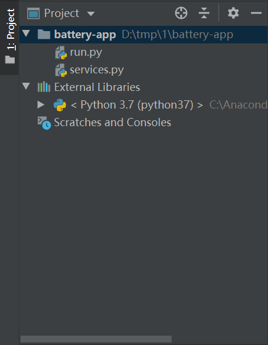

# Lab 2. Create a Web Project

In this lab, we will create a Python Flask web project to develop an application.

## Step 1: Install Python Dependency

Install `Flask` and `EnOS Python Core SDK` by the following steps:

1. Open JetBrains PyCharm Community Edition and enter the following codes in terminal to install `flask` framework:

   ```
   pip install flask
   ```

2. In Pycharm terminal, enter the following codes to install EnOS Python Core SDK:

   ```
   pip install aphrodite
   ```

## Step 2: Create a Project

Create a Python Flask project in Pycharm by the following steps:

1. Open the JetBrains PyCharm Community Edition and select **File > New Project** from the menu.

2. Configure the following fields on the **Create Project** window:

   - Location: browse and select the target project folder
   - Existing Interpreter: enbale, and select **Python 3.7** from the dropdown list of **Interpreter**

3. click **Create**.

    

4. In the project, select **File > New > Python File** from the menu and create a python file named `run.py`.

   

5. Open the `run.py` file and add the following codes:

   ```python
   from flask import Flask, request, render_template  # Lightweight web framework
   from datetime import timedelta, datetime
   from services import *
   
   # *****application logic*****
   
   # Initialize hte web framework
   app = Flask(__name__, template_folder='./templates/', static_folder='./static/')
   
   
   # The following @app.route decorator is used to register the web request handler
   
   @app.route('/', endpoint='index')
   def index():
       return render_template('battery.html')
   
   
   @app.route('/battery/list/', endpoint='battery.list')
   def list():
       parent_assetId = '6Pvbj63S'  # Change this to your battery's parent assentId
       results = get_child_asset_list(parent_assetId)
   
       resp = {}
       battery_list = {}
   
       if results is not None:
           for item in results['data']:
               battery_list[item['name']['defaultValue']] = item['assetId']
   
       # Sort the asset list in ascending order by the aseet name
       sorted_list = [{'name': k, 'assetId': battery_list[k]} for k in sorted(battery_list.keys())]
       resp['batteries'] = sorted_list
   
       return resp
   
   
   @app.route('/battery/asset/<assetId>', endpoint='battery.asset')
   def asset(assetId):
       req = get_asset_info(assetId)
       return req
   
   
   @app.route('/battery/status/<assetId>', endpoint='battery.status')
   def status(assetId):
       req = get_asset_info(assetId)
       capacity = 10
       if req is not None:
           capacity = req['data']['attributes']['Capacity']
   
       health_level = 100
       accumulating_power = 0
   
       req = get_asset_latest_data(assetId, 'health_level,accumulating_power')
       if req is not None:
           for item in req['data']['items']:
               if 'health_level' in item.keys():
                   health_level = int(item['health_level'])
               elif 'accumulating_power' in item.keys():
                   accumulating_power = float(item['accumulating_power'])
   
       # Calculate the remaining power percentage of batteries
       remaining_power = "%.0f%%" % (100 * accumulating_power / capacity)
   
       resp = {'health_level': health_level, 'remaining_power': remaining_power}
   
       return resp
   
   
   @app.route('/battery/tsdb/<assetId>', endpoint='battery.tsdb')
   def tsdb(assetId):
       endTime = datetime.now()
       startTime = endTime + timedelta(hours=-1)
       startTime = startTime.strftime(format='%Y-%m-%d %H:%M:%S')
       endTime = endTime.strftime(format='%Y-%m-%d %H:%M:%S')
       req = get_asset_ai_raw_data(assetId, startTime, endTime)
   
       # Arrange the returned data in array format
       time = []
       current = []
       voltage = []
       temp = []
   
       if req is not None:
           for item in req['data']['items']:
               if 'current' in item.keys():
                   time.append(item['localtime'])
                   current.append(item['current'])
               elif 'voltage' in item.keys():
                   voltage.append(item['voltage'])
               elif 'temp' in item.keys():
                   temp.append(item['temp'])
               else:
                   pass
   
       # Assemble the response structure
       resp = {'time': time, 'voltage': voltage, 'current': current, 'temp': temp}
   
       return resp
   
   
   @app.route('/battery/alerts/', endpoint='battery.alerts')
   def alerts():
       req = get_active_alerts()
   
       # Add asset name for each alert record
       if req is not None:
           for item in req['data']:
               result = get_asset_info(item['assetId'])
               if result['data'] is not None:
                    item['assetName'] = result['data']['name']['defaultValue']
   
       return req
   
   
   @app.route('/battery/service/<assetId>', endpoint='battery.service', methods=['POST'])
   def service(assetId):
       req = {}
       if request.method == 'POST':
           if request.form['command'] == 'set_frequency':
               freq = int(request.form['parameter'])
               req = set_battery_frequency(assetId, freq)
   
       res = {
           "status": "success",
           "result": req
       }
       return res
   
   
   # Main entrance
   if __name__ == '__main__':
       app.debug = True
       app.run()
   ```
    Tips:
    - If you encountered static content (images, stylesheet) 404, you can add **static_url_path=""** at this line.
    ```
        app = Flask(__name__, template_folder='./templates/', static_url_path="", static_folder='./static/')
    ```
6. In the project, select **File > New > Python File** from the menu and create a python file named `services.py`.

   

7. Open the `services.py` file and add following codes:

   ```python
   from poseidon import poseidon  # This is the python SDK for EnOS API.
   import urllib.parse as parser  # The library to convert a dictionary into query string.
   
   # The AccessKey and SecretKey, you get it when you register an application. Replace the value with the Access Key and Secret Key of the SmartBattery_Demo application.
   app_access_key = '0787eefe-d96c-4db6-a97c-c5ee16ce9a93'
   app_secret_key = '7b12307f-4993-4ef3-8554-93c6cc0e3cb6'
   
   # The api gateway address. Replace the value with the gateway address of the EnOS_Training OU.
   api_gateway = 'https://apim-ppe1.envisioniot.com'
   
   # The training OU Id in which we perform our experiment. Replace the value with the ID of the EnOS_Training OU.
   training_orgId = 'o15724268424841'
   # Asset Tree Id. Replace the value with the ID of the asset tree of your smart battery devices.
   battery_provider_treeId = '50XiYXpx'
   
   
   # The following function is used to query assets under the specified parent node,
   # by specifying orgId and treeId of the asset tree.
   # Refer to `Search Related Asset Node` API doc in our doc center.
   # Args:
   #   parentId: The parent asset Id under which the child assets is located
   def get_child_asset_list(parentId):
       pass
   
   
   # The following function is used to query the specified asset information by specifying asset Id.
   # Refer to `Get Asset` API doc in our doc center.
   # Args:
   #   assetId: The asset Id you want to query
   def get_asset_info(assetId):
       pass
   
   
   # The following function is used to get the latest reading of all measurement points of a specified device.
   # Refer to `Get Asset Latest Data` API doc in our doc center.
   # Args:
   #   assetIds: The asset Id to query, multiple assets can be sperated by comma.
   #   measurepoints: The measure poin Ids to query, multiple measure points can be sperated by comma.
   def get_asset_latest_data(assetIds, measurepoints):
       pass
   
   
   # The following function is used to get the AI raw data of current, voltage and temperature
   # for the specified battery device within a certain period.
   # Refer to `Get Asset AI Raw Data` API doc in our doc center.
   # Args:
   #   assetId: The asset Id you want to query
   #   startTime: Time of start sampling data, UTC time format or local time format
   #   endTime: Time of end sampling data, UTC time format or local time format
   def get_asset_ai_raw_data(assetId, startTime, endTime):
       pass
   
   
   # The following function is used to get the current active alerts from all the batteries
   # on the battery asset tree.
   # Refer to `Search Active Alerts` API doc in our doc center.
   def get_active_alerts():
       pass
   
   
   # The following function is used to get the current active alerts from all the batteries
   # on the battery asset tree.
   # Refer to `Search Active Alerts` API doc in our doc center.
   def set_battery_frequency(assetId, frequency):
       pass
   ```

The configured Python project structure should look like this:



## Step 3: Add the Front End

After configuring the Python project, you need to extract the provided front-end package to the Python web project by the following steps:

1. Download the front-end package `Front_End.zip` from https://github.com/EnvisionIot/developer_bootcamp/tree/master/App_Front_End.

2. Extract the front-end package to the `root` directory of the Python web project. Ensure that `static`,  `templates`, `run.py` and `services.py` are under the same directory. The directory structure should look like this:

   ```shell
   ├── root
   │   ├── static/
   │   ├── templates/
   │   ├── run.py
   │   ├── services.py
   ```

3. In the project root directory, run the following command to start the application:

   ```
   python run.py
   ```

   

4. Open a browser and enter `http://127.0.0.1:5000` in the address field to view the application. 

   

Currently, no data is displayed in the application page.

In the next step, you will try to call EnOS APIs to perform the following tasks:

- Get the battery asset list
- Get battery asset information
- Get the battery status (health level and remaining power)
- Get the asset alert records
- Set battery data uploading frequency 
- Get the dynamic data of batteries: real-time voltage, current, and temperature

## Next Unit

[Lab 3. Invoke EnOS APIs](invoking_api_python.md)