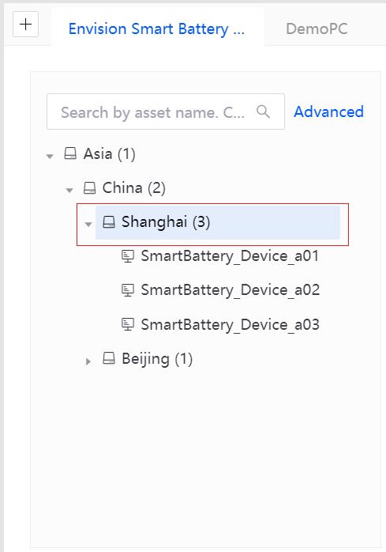
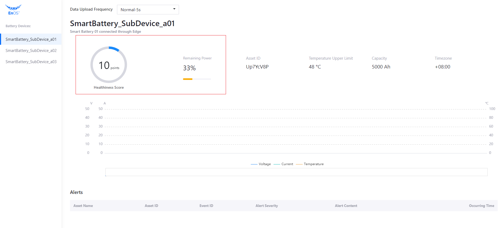

# Lab 3. Invoke EnOS APIs

In this lab, we will invoke EnOS APIs for the following purposes:

- Get the battery asset list
- Get battery asset information
- Get the battery status (health level and remaining power)
- Get the asset alert records
- Set battery data uploading frequency 
- Get the dynamic data of batteries: real-time voltage, current, and temperature

## Step 1: Get Battery Asset List

Invoke **Search Related Asset Node** API and configure `get_child_asset_list` function by the following steps to get battery asset list:

> The request format of **Search Related Asset Node** is `https://{apigw-address}/asset-tree-service/v2.1/asset-nodes?action=searchRelatedAsset`.

1. In the `services.py` file, find the `get_child_asset_list` stub function, and enter the following codes to get the list of battery assets in the specified asset tree node:

   ```
   def get_child_asset_list(parentId):
       url = api_gateway + '/asset-tree-service/v2.1/asset-nodes?'
   
       query_data = {
           'action': 'searchRelatedAsset',
           'treeId': battery_provider_treeId,
           'orgId': training_orgId}
   
       query_string = parser.urlencode(query_data)
       url += query_string
   
       data = {
           "filter": {
               "isChildOfAssetId": parentId  # Specify the parent node Id for this query
           },
           "projection": ["assetId", "name.defaultValue"]
       }
   
       # poseidon.urlopen is the function defined in our SDK to send an API request.
       req = poseidon.urlopen(app_access_key, app_secret_key, url, data)
       return req
   ```
   

2. With the programming work completed, you can now test the codes by clicking **Run > Run** to start the application.

   

3. Open a browser, enter `http://127.0.0.1:5000` in the address field, and you should be able to see the retrieved battery list.


## Step 2: Get the Asset Information of a Specific Battery

Invoke **Get Asset** API and configure the `get_asset_info` function by the following steps to to get the asset information of a specific battery:

> The request format of **Get Asset** is `https://{apigw-address}/asset-service/v2.0/assets?action=get`.

1. In the `services.py` file, find the `get_asset_info` stub function and enter the following codes to get the battery asset information:

   ```
   def get_asset_info(assetId):
       url = api_gateway + '/asset-service/v2.1/assets?'
   
       query_data = {
           'action': 'get',
           'orgId': training_orgId,
           'assetId': assetId}
   
       query_string = parser.urlencode(query_data)
       url += query_string
   
       req = poseidon.urlopen(app_access_key, app_secret_key, url)
   
       return req
   ```

2. Click **Run > Run** to start the application.

3. Open a browser, enter `http://127.0.0.1:5000` in the address field and you should be able to see the retrieved battery asset information. 


## Step 3: Get the Status of a Specific Battery

Invoke **Get Asset Latest Data** API and configure the `get_asset_latest_data` function by the following steps to get the status of a specific battery:

> The request format of **Get Asset Latest Data** is `https://{apigw-address}/tsdb-service/v2.0/latest?orgId={}&assetIds={}&measurepoints={}&timeWindow={}&accessKey={}`.

1. In the `services.py` file, find the `get_asset_latest_data` stub function, and enter the following codes to get the battery latest status information:

   ```
   def get_asset_latest_data(assetIds, measurepoints):
       url = api_gateway + '/tsdb-service/v2.0/latest?'
   
       query_data = {
           'orgId': training_orgId,
           'assetIds': assetIds,
           'measurepoints': measurepoints,
           'timeWindow': '',
           'accessKey': app_access_key}
   
       query_string = parser.urlencode(query_data)
       url += query_string
   
       req = poseidon.urlopen(app_access_key, app_secret_key, url)
       return req
   ```

2. Click **Run > Run** to start the application.

3. Open a browser, enter `http://127.0.0.1:5000` in the address field, and you should be able to see the retrieved battery health level and remaining power information.



## Step 4: Get the Active Alerts of a Specific Asset Tree

Invoke **Search Active Alerts** API and configure the `get_active_alerts` function by the following steps to get the active alerts of a specific asset tree:

> The request format of **Search Active Alerts** is `https://{apigw-address}/event-service/v2.1/active-alerts?action=search`.

1. In the `services.py` file, find the `get_active_alerts` stub function, and enter the following codes to get the asset tree active alerts:

   ```
   def get_active_alerts():
       url = api_gateway + '/event-service/v2.1/active-alerts?'
   
       query_data = {
           'action': 'search',
           'orgId': training_orgId}
   
       query_string = parser.urlencode(query_data)
       url += query_string
   
       data = {
           "scope": {
               "treeId": battery_provider_treeId  # Specify the asset tree from which to search active alerts
           },
           "pagination": {
               "pageNo": 1,
               "pageSize": 10
           }
       }
   
       req = poseidon.urlopen(app_access_key, app_secret_key, url, data)
       return req
   ```

2. Click **Run > Run** to start the application.

3. Open a browser, enter `http://127.0.0.1:5000` in the address field, and you should be able to see the retrieved active alert records. 


## Step 5: Set the Data Uploading Frequency

Invoke **Invoke Service** API and configure the `set_battery_frequency` function by the following steps to set data uploading frequency.

> The request format of **Invoke Service** is `https://{apigw-address}/connect-service/v2.1/commands?action=invokeService`.

1. In the `services.py` file, find the `set_battery_frequency` stub function, and enter the following codes to get the battery data uploading frequency:

   ```
   def set_battery_frequency(assetId, frequency):
       url = api_gateway + '/connect-service/v2.1/commands?'
   
       query_data = {
           'action': 'invokeService',
           'orgId': training_orgId,
           'assetId': assetId,
           'serviceId': 'high_frequency_report_service',
           'pendingTtl': 1000}
   
       query_string = parser.urlencode(query_data)
       url += query_string
   
       print(url)
   
       data = {
           "inputData": {
               "interval": frequency
           }
       }
   
       req = poseidon.urlopen(app_access_key, app_secret_key, url, data)
       return req
   ```

2. Click **Run > Run** to start the application. 

Currently in this application, you still cannot see the direct result of the changed data uploading frequency because you have not retrieved the dynamic battery data, including the voltage, current, and temperature. In the next lab, you will complete the remaining development process.

For more information on EnOS API, see [EnOS™ API](https://support.envisioniot.com/docs/api/en/2.3.0/overview.html).

## Next Lab

[Lab 4. Develop by Yourself](developing_by_yourself_python.md)