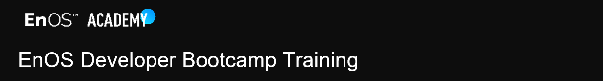

[EN](Developer_Bootcamp_EN/README.md) | [中文](Developer_Bootcamp_CN/README.md)

Welcome on board to the EnOS Developer Bootcamp!

In this training, you’ll:

- Deep dive into all services / features of EnOS.
- Learn how to select connectivity solutions, analyze your data, and develop an application with EnOS service capabilities.
- Build your 1st application on EnOS. No worries, step-by-step tutorials are provided to help you with all hands-on workshops.
